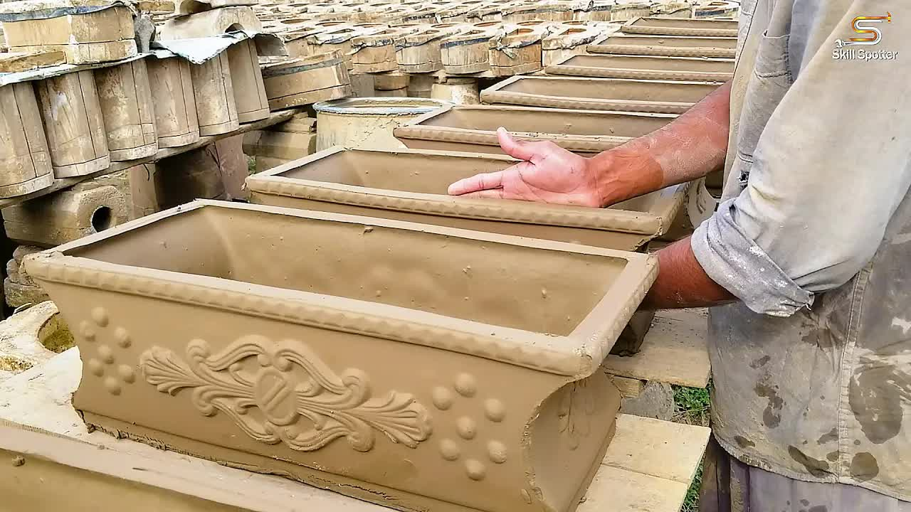

# Slip-Casting-Process-of-Rectangular-Clay-Flower-Pots-｜-Superb-Technique-of-Flower-Pot-Making

> 🆓 **نسخه رایگان** - کیفیت 360p
> برای کیفیت بالاتر، MP3، زیرنویس و رمزگذاری به [workflow شماره 01](../../actions) بروید

  <picture>
    
  </picture>

---

## Video Information

| Property | Value |
|----------|-------|
| **Video Name** | `Slip-Casting-Process-of-Rectangular-Clay-Flower-Pots-｜-Superb-Technique-of-Flower-Pot-Making` |
| **Original Link** | [YouTube Video](https://www.youtube.com/watch?v=rDNNXyDwYtU) |
| **Total Size** | **42.31 MB** |
| **Quality** | **360p (Free)** |

---

## Download Link

| # | File | Link |
|---|------|------|
| 1 | `Slip-Casting-Process-of-Rectangular-Clay-Flower-Pots-｜-Superb-Technique-of-Flower-Pot-Making.mp4` | [Download](https://raw.githubusercontent.com/dbarashdb-boop/Ourtube/main/videos/Slip-Casting-Process-of-Rectangular-Clay-Flower-Pots-%EF%BD%9C-Superb-Technique-of-Flower-Pot-Making/Slip-Casting-Process-of-Rectangular-Clay-Flower-Pots-%EF%BD%9C-Superb-Technique-of-Flower-Pot-Making.mp4) |

---

*🆓 Free Version - [avasam.ir](https://avasam.ir)*
